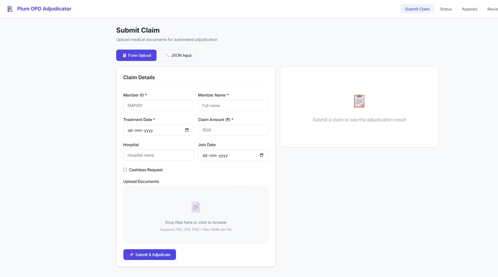
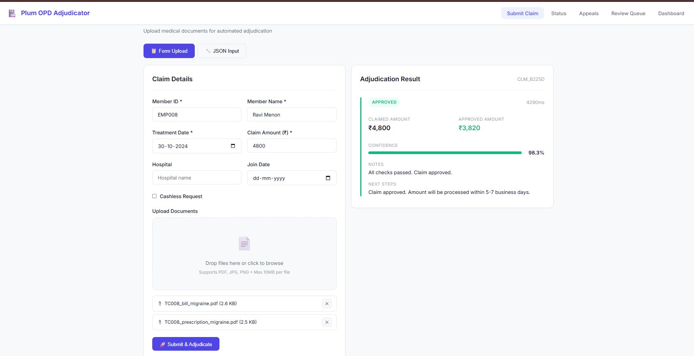
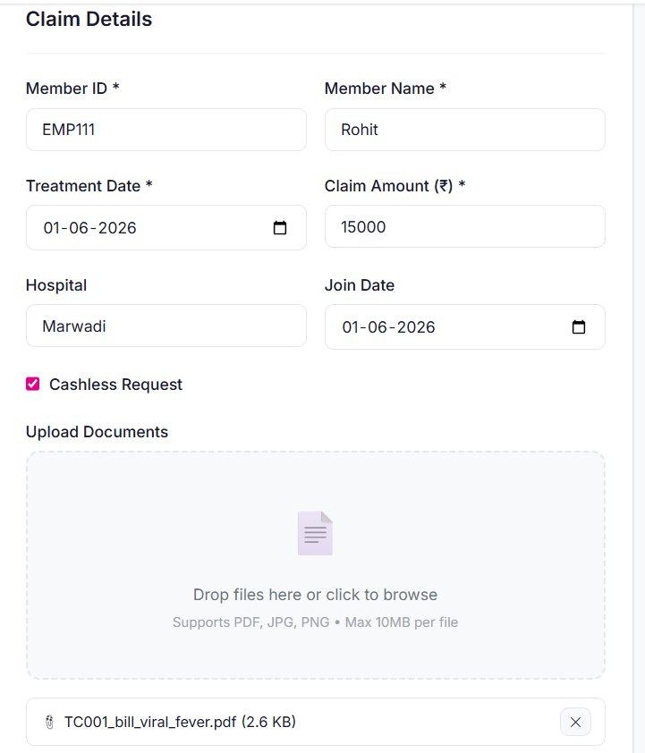
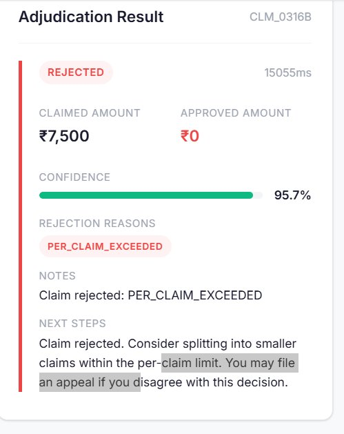
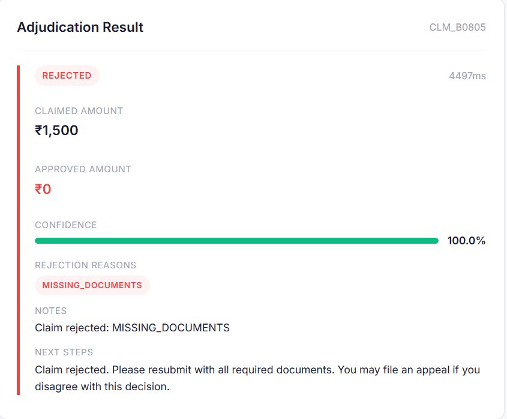
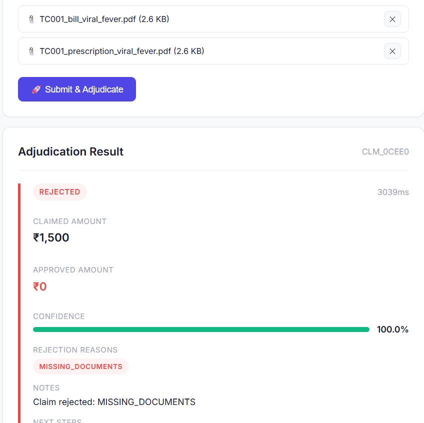
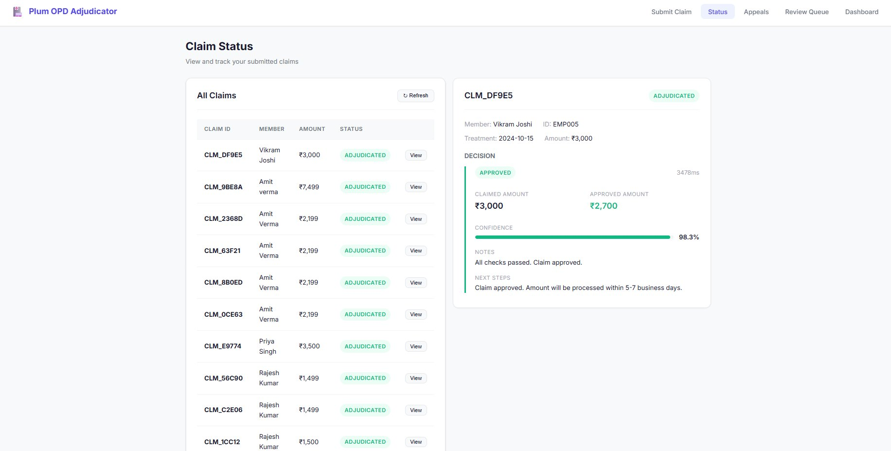
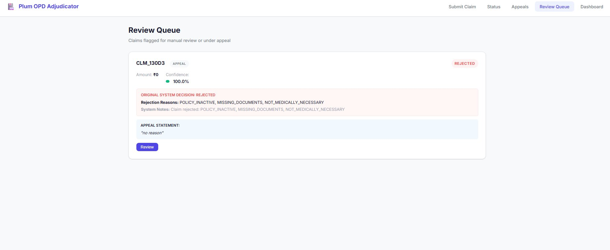
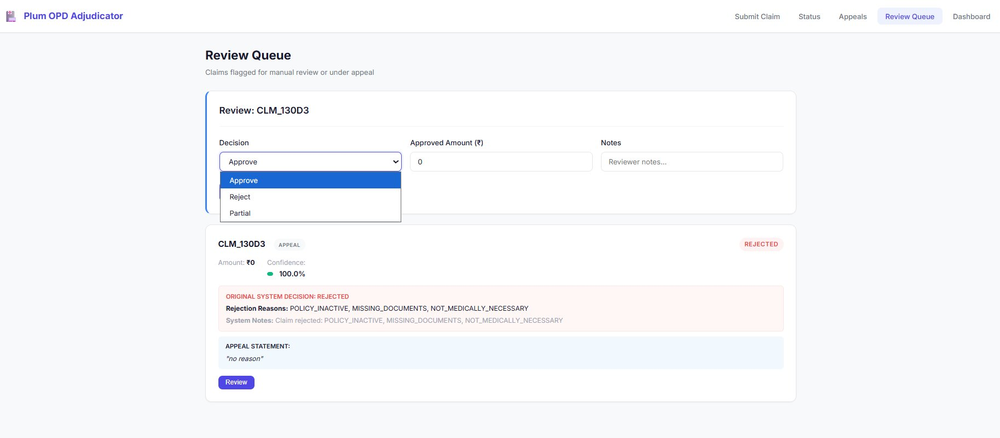

# Plum OPD Claim Adjudicator 🩺🤖

An intelligent **Outpatient Department (OPD)** insurance claim adjudication system that automates verification, policy validation, fraud checking, and decision-making for insurance claims using a hybrid pipeline of **LLMs**, **Retrieval-Augmented Generation (RAG)**, and a **deterministic rules engine**.

Youtube Link - https://www.youtube.com/watch?v=b5NIg1BQmQM

Demo Link - https://huggingface.co/spaces/krishnakumar19/plum-opd-claim-adjudicator

---

## 📋 Table of Contents

1. [Key Features](#-key-features)
2. [Technology Stack](#️-technology-stack)
3. [Adjudication Pipeline Flow](#-adjudication-pipeline-flow)
4. [System Screenshots](#-system-screenshots)
5. [Repository Structure](#-repository-structure--file-map)
6. [Quick Start](#-quick-start)
7. [Docker Compose](#-docker-compose)
8. [Verification Commands](#-verification-commands)

---

## 🌟 Key Features

- **AI OCR Fallback** — Utilizes **Gemini 2.5 Flash** (OpenRouter) to extract text from handwritten prescriptions or noisy scans.
- **Few-Shot Data Parsing** — Employs **Groq Llama 3.3 70B** to structure unstructured medical text into schema-conforming JSON data.
- **5-Step Validation Engine** — Validates Eligibility, Coverage, Limits, Medical Necessity, and Fraud.
- **Vector Policy RAG** — Query-aware matching using ChromaDB and BGE-small embeddings.
- **Auto-Auditing** — Automatically routes claims below a dynamic confidence threshold to a manual review queue.
- **Interactive Appeals** — Resolves claim disputes directly through the auditor dashboard.

---

## 🛠️ Technology Stack

| Layer         | Technology                                                                 |
|---------------|----------------------------------------------------------------------------|
| **Frontend**  | React 18, Vite, HSL-tailored styling                                       |
| **Backend**   | FastAPI (Python 3.10+), SQLAlchemy                                         |
| **Database**  | SQLite (Claims & Appeals metadata)                                         |
| **AI Models** | Groq Llama 3.3 70B (Text Extraction), Gemini 2.5 Flash (Vision OCR), Mistral Small (Fallback) |
| **RAG**       | ChromaDB + BGE-small-en-v1.5 embeddings                                    |
| **Container** | Docker + Docker Compose                                                    |

---

## 🔄 Adjudication Pipeline Flow

The system runs a 10-step pipeline on every submitted claim:

```
Document Intake
      │
      ▼
1. Document OCR ──────── Extracts raw text from PDFs; runs Gemini Vision OCR on scans
      │
      ▼
2. Data Extraction ────── Groq Llama 3.3 converts raw text to structured JSON schema
      │
      ▼
3. Doc Validation ─────── Checks doctor registration, stamps, signatures, and dates
      │
      ▼
4. Eligibility Check ──── Evaluates member active state and waiting periods
      │
      ▼
5. Coverage Check ─────── Audits excluded treatments & drugs via RAG (ChromaDB)
      │
      ▼
6. Limits Check ───────── Computes caps, copays, and network discounts
      │
      ▼
7. Medical Necessity ──── Reason-checks if treatment matches the diagnosis
      │
      ▼
8. Fraud Check ────────── Screens for duplicates, age mismatch, and blacklisted providers
      │
      ▼
9. Confidence Scoring ─── Calculates weighted certainty; routes to manual review if low
      │
      ▼
10. Final Decision ─────── Outputs: APPROVED / REJECTED / PARTIAL / MANUAL_REVIEW
```

---

## 📸 System Screenshots

### 1. Submit Claim — Empty Form (`01_submit_claim_empty_form.png`)

The Submit Claim page on desktop. Members fill in their Member ID, Member Name, Treatment Date, Claim Amount (₹), Hospital name, and Join Date. A **Cashless Request** checkbox is available. Documents (PDF, JPG, PNG up to 10 MB each) are attached via drag-and-drop. The adjudication result panel on the right prompts the user to submit to see a result.



---

### 2. Submit Claim — Approved Result (`02_submit_claim_approved_result.png`)

After submitting a claim for **Ravi Menon (EMP008)** with a ₹4,800 treatment for migraine (files: `TC008_bill_migraine.pdf` + `TC008_prescription_migraine.pdf`), the adjudication pipeline runs in **4,290 ms** and returns:

- **Status**: ✅ APPROVED
- **Claimed Amount**: ₹4,800 → **Approved Amount**: ₹3,820
- **Confidence**: 98.3%
- **Notes**: All checks passed. Claim approved.
- **Next Steps**: Amount will be processed within 5–7 business days.



---

### 3. Mobile — Claim Form (Cashless Request) (`03_mobile_claim_form_cashless.png`)

Mobile view of the claim submission form filled out for:
- **Member**: EMP111 — Rohit
- **Treatment Date**: 01-06-2026 | **Claim Amount**: ₹15,000
- **Hospital**: Marwadi | **Join Date**: 01-06-2026
- **Cashless Request**: ✅ Checked
- **Document**: `TC001_bill_viral_fever.pdf` attached

This screenshot demonstrates the cashless claim pathway, where the system validates the hospital's network status before approving direct cashless settlement.



---

### 4. Mobile — Rejected: Per-Claim Limit Exceeded (`04_mobile_rejected_per_claim_exceeded.png`)

Adjudication result for claim **CLM_0316B** showing a per-claim cap rejection:

- **Status**: ❌ REJECTED (15,055 ms)
- **Claimed Amount**: ₹7,500 → **Approved Amount**: ₹0
- **Confidence**: 95.7%
- **Rejection Reason**: `PER_CLAIM_EXCEEDED`
- **Notes**: Claim rejected: PER_CLAIM_EXCEEDED
- **Next Steps**: Consider splitting into smaller claims within the per-claim limit. You may file an appeal if you disagree.



---

### 5. Mobile — Rejected: Missing Documents (Detail) (`05_mobile_rejected_missing_documents.png`)

Adjudication result for claim **CLM_B0805** rejected due to incomplete documentation:

- **Status**: ❌ REJECTED (4,497 ms)
- **Claimed Amount**: ₹1,500 → **Approved Amount**: ₹0
- **Confidence**: 100.0%
- **Rejection Reason**: `MISSING_DOCUMENTS`
- **Notes**: Claim rejected: MISSING_DOCUMENTS
- **Next Steps**: Please resubmit with all required documents. You may file an appeal if you disagree.



---

### 6. Submit — Rejected: Missing Documents (with uploaded files shown) (`06_submit_rejected_missing_documents_detail.png`)

Mobile view showing the claim submission for **TC001 viral fever** case with both `TC001_bill_viral_fever.pdf` and `TC001_prescription_viral_fever.pdf` attached. Despite documents being attached, the result for **CLM_0CEE0** was:

- **Status**: ❌ REJECTED (3,039 ms)
- **Claimed Amount**: ₹1,500 → **Approved Amount**: ₹0
- **Confidence**: 100.0%
- **Rejection Reason**: `MISSING_DOCUMENTS`
- **Notes**: Claim rejected: MISSING_DOCUMENTS

This illustrates a case where documents were uploaded but failed the validation check (e.g., missing doctor's stamp, invalid registration number, or illegible scan).



---

### 7. Claim Status Portal (`07_claim_status_portal.png`)

The **Claim Status** page showing all submitted claims and their current status. The left panel lists claims with member names, amounts, and `ADJUDICATED` status tags. Clicking a claim opens the full decision detail on the right. Shown: **CLM_DF9E5** (Vikram Joshi, EMP005, ₹3,000 claimed → ₹2,700 approved, 98.3% confidence, 3,478 ms).

Notable claims in the list view:
| Claim ID    | Member        | Amount  | Status       |
|-------------|---------------|---------|--------------|
| CLM_DF9E5   | Vikram Joshi  | ₹3,000  | ADJUDICATED  |
| CLM_9BE8A   | Amit Verma    | ₹7,499  | ADJUDICATED  |
| CLM_2368D   | Amit Verma    | ₹2,199  | ADJUDICATED  |
| CLM_E9774   | Priya Singh   | ₹3,500  | ADJUDICATED  |
| CLM_56C90   | Rajesh Kumar  | ₹1,499  | ADJUDICATED  |



---

### 8. Review Queue — Rejected Appeal (`08_review_queue_rejected_appeal.png`)

The **Review Queue** displaying claim **CLM_130D3** flagged under appeal:

- **Status**: ❌ REJECTED | Tag: `APPEAL`
- **Amount**: ₹0 | **Confidence**: 100.0%
- **Original Rejection Reasons**: `POLICY_INACTIVE`, `MISSING_DOCUMENTS`, `NOT_MEDICALLY_NECESSARY`
- **System Notes**: Claim rejected: POLICY_INACTIVE, MISSING_DOCUMENTS, NOT_MEDICALLY_NECESSARY
- **Appeal Statement**: *"no reason"*
- **Action**: `Review` button to open the override panel



---

### 9. Review Queue — Manual Override Dropdown (`09_review_queue_override_dropdown.png`)

The Review Queue **override modal** for claim **CLM_130D3**. The auditor can override the system decision using:
- **Decision Dropdown**: Approve / Reject / Partial
- **Approved Amount (₹)**: manually entered
- **Notes**: Free-text reviewer notes

The dropdown is shown open with all three override options visible. This allows human auditors to reverse or modify system decisions based on additional context or appeal merits.



---

## 📁 Repository Structure & File Map

```
plum-opd-claim-adjudicator/
│
├── backend/
│   ├── main.py                     # API entrypoint, CORS config, and lifespan events
│   ├── config.py                   # Environment BaseSettings + dynamic JSON policy loader
│   ├── database.py                 # SQLite connection session context
│   │
│   ├── models/                     # SQLAlchemy ORM Schema Models
│   │   ├── claim.py                # Claim metadata (member, hospital, dates, status)
│   │   ├── decision.py             # Adjudication output (approved amount, deductions, logs)
│   │   └── appeal.py               # Appeals model (reasons, reviewer comments)
│   │
│   ├── api/                        # REST API Endpoint Routers
│   │   ├── claims.py               # Submit claims, run OCR, trigger adjudication
│   │   ├── decisions.py            # Expose adjudication records & decision histories
│   │   ├── appeals.py              # Handle member appeal submissions and resolutions
│   │   ├── admin.py                # Overview stats and manual audit queue endpoints
│   │   └── evaluation.py           # Expose accuracy suite endpoints
│   │
│   ├── services/                   # Backend Business Logic Services
│   │   ├── adjudication_service.py # Core workflow coordinator linking all engine checks
│   │   ├── ocr_service.py          # PDF parsing + Gemini 2.5 Flash Vision OCR
│   │   ├── extraction_service.py   # Groq parser: raw medical text → JSON schemas
│   │   ├── confidence_service.py   # Weighted accuracy scores for auto-audit routing
│   │   ├── fraud_service.py        # Duplicate detection, data mismatch, blacklists
│   │   └── evaluation_service.py   # Ground-truth evaluation runner
│   │
│   ├── ai/                         # AI Core Integrations
│   │   ├── gemini_client.py        # Multi-provider wrapper with automatic fallbacks
│   │   │
│   │   ├── rag/                    # Retrieval-Augmented Generation Modules
│   │   │   ├── embeddings.py       # Vector generation via BGE-small-en-v1.5
│   │   │   ├── vectordb.py         # ChromaDB PersistentClient connection manager
│   │   │   ├── ingest.py           # Ingests & chunks policy JSONs and markdown files
│   │   │   └── retriever.py        # Local keyword matcher with ChromaDB fallback
│   │   │
│   │   └── decision_engine/        # 5-Stage Adjudication Engine
│   │       ├── eligibility.py      # Member enrollment & waiting period validation
│   │       ├── coverage.py         # Covered categories and excluded items inspection
│   │       ├── limits.py           # Caps for consultations, diagnostics, discounts
│   │       ├── medical_necessity.py# Treatment ↔ diagnosis necessity engine
│   │       └── final_decision.py   # Rules aggregator → final claim outcome
│   │
│   └── utils/                      # Shared Helpers
│       ├── constants.py            # Status enums, default limits, rejection codes
│       ├── logger.py               # Console logger configuration
│       ├── parsers.py              # Currency, date, and PDF parsing utilities
│       └── validators.py           # Regex validators for doctor registrations
│
├── frontend/
│   ├── Dockerfile                  # Multi-stage React Vite build → Nginx SPA proxy
│   ├── package.json                # NPM package manifest
│   │
│   └── src/
│       ├── main.jsx                # React DOM root render
│       ├── App.jsx                 # Routing: status, appeals, review pages
│       ├── index.css               # CSS variables and themes
│       │
│       ├── services/api.js         # Axios client → uvicorn endpoint mappings
│       │
│       ├── components/
│       │   ├── MetricsCard.jsx     # Glassmorphism stat cards with trends
│       │   ├── ConfidenceMeter.jsx # Progress bar for decision confidence
│       │   ├── DecisionCard.jsx    # Approved amounts + deduction breakdown
│       │   ├── FileUploader.jsx    # Drag-and-drop file uploader
│       │   ├── ReviewCard.jsx      # Auditor manual review override card
│       │   └── AppealForm.jsx      # Appeal submission modal form
│       │
│       └── pages/
│           ├── UploadClaim.jsx     # Upload inputs and file selectors page
│           ├── ClaimStatus.jsx     # User portal for tracking claims and appeals
│           ├── ReviewQueue.jsx     # Manual review and appeal action queue
│           └── AdminDashboard.jsx  # Stats dashboard and accuracy suite
│
├── data/
│   ├── policies/policy_terms.json  # Coverage definitions and network hospitals
│   ├── rules/adjudication_rules.md # Adjudication rules parsed by RAG ingestor
│   └── evaluations/test_cases.json # Ground truth evaluation inputs
│
├── prompts/
│   ├── extraction_prompt.txt       # System prompt rules for structuring medical data
│   └── few_shot_examples.json      # Structural example pairs loaded during parsing
│
├── tests/
│   ├── test_adjudication.py        # End-to-end adjudication tests
│   ├── test_appeals.py             # Appeal creation and auditor update tests
│   ├── test_confidence.py          # Confidence score weight range validation
│   ├── test_fraud.py               # Duplicate detection and clinic blacklist tests
│   ├── test_ocr.py                 # PDF extractor and file detection evaluation
│   └── test_rag.py                 # Vector indexing and retrieval verification
│
├── docs/                           # 📸 Project Screenshots (renamed)
│   ├── 01_submit_claim_empty_form.png              # Desktop submit claim form (empty)
│   ├── 02_submit_claim_approved_result.png         # Desktop: approved result for Ravi Menon
│   ├── 03_mobile_claim_form_cashless.png           # Mobile: cashless claim form (Rohit/EMP111)
│   ├── 04_mobile_rejected_per_claim_exceeded.png   # Mobile: rejected — per-claim limit hit
│   ├── 05_mobile_rejected_missing_documents.png    # Mobile: rejected — missing documents (detail)
│   ├── 06_submit_rejected_missing_documents_detail.png # With files uploaded but still rejected
│   ├── 07_claim_status_portal.png                  # Desktop: all claims list + decision panel
│   ├── 08_review_queue_rejected_appeal.png         # Review queue: APPEAL tag on rejected claim
│   └── 09_review_queue_override_dropdown.png       # Review queue: auditor override dropdown open
│
├── docker-compose.yml              # Runs backend + frontend SPA containers
├── Dockerfile                      # Backend Docker configuration
└── requirements.txt                # Pip backend dependencies
```

---

## 🚀 Quick Start

### Local Setup

#### 1. Start Backend FastAPI

```bash
# Install dependencies
pip install -r requirements.txt

# Start uvicorn dev server on port 8000
uvicorn backend.main:app --port 8000 --reload
```

#### 2. Start Frontend UI

```bash
cd frontend

# Install Node dependencies
npm install

# Start Vite dev server
npm run dev
```

Open [http://localhost:5173/](http://localhost:5173/) in your browser.

---

## 🐳 Docker Compose

Run both backend and frontend inside production containers:

```bash
docker-compose up --build
```

| Service      | URL                                           |
|--------------|-----------------------------------------------|
| **Frontend** | [http://localhost:5173/](http://localhost:5173/) |
| **Backend**  | [http://localhost:8001/](http://localhost:8001/) (via proxy) |

---

## 🧪 Verification Commands

```bash
# Run backend unit tests
python -m pytest tests/ -v --tb=short

# Run evaluations suite benchmark
python scripts/run_evaluation.py

# Inject dummy claims data for visualization
python scripts/generate_mock_claims.py
```

---

## 🔍 Adjudication Decision Reference

| Decision Code         | Meaning                                                    |
|-----------------------|------------------------------------------------------------|
| `APPROVED`            | All checks passed; amount processed within 5–7 business days |
| `REJECTED`            | One or more checks failed; see rejection reason code below  |
| `PARTIAL`             | Partial approval after cap or copay deductions              |
| `MANUAL_REVIEW`       | Confidence below threshold; routed to auditor queue         |

### Rejection Reason Codes

| Code                    | Description                                            |
|-------------------------|--------------------------------------------------------|
| `MISSING_DOCUMENTS`     | Required bill, prescription, or stamp not found/invalid |
| `PER_CLAIM_EXCEEDED`    | Claim amount exceeds the per-claim policy cap           |
| `POLICY_INACTIVE`       | Member's policy is not active or in waiting period      |
| `NOT_MEDICALLY_NECESSARY` | Treatment does not match the stated diagnosis          |
| `DUPLICATE_CLAIM`       | A claim for the same event has already been submitted   |
| `EXCLUDED_TREATMENT`    | Treatment/drug is explicitly excluded in policy terms   |
| `BLACKLISTED_PROVIDER`  | Hospital or doctor is on the fraud blacklist            |

---

## 🧠 AI Model Roles

| Model                    | Provider   | Role                                                  |
|--------------------------|------------|-------------------------------------------------------|
| **Gemini 2.5 Flash**     | OpenRouter | Vision OCR on handwritten prescriptions / noisy scans |
| **Groq Llama 3.3 70B**   | Groq       | Few-shot parsing of raw text → structured JSON schema |
| **Mistral Small**        | Mistral    | Fallback LLM when primary providers are unavailable   |
| **BGE-small-en-v1.5**    | HuggingFace| Embedding model for ChromaDB RAG policy retrieval     |

---

*Built for automated, explainable, and auditable OPD insurance claim processing.*
